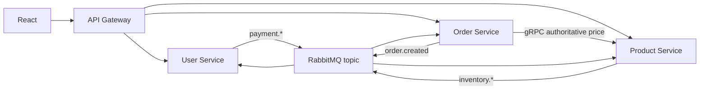

# Architecture

The public path is `React -> API Gateway -> services`. The gateway proxies authentication and orders, and exposes product reads through the product gRPC client. User owns MongoDB and wallet state; product owns its PostgreSQL/TypeORM data; order owns PostgreSQL/Prisma data. No service accesses another service database.

Kubernetes `ClusterIP` services should back internal services. The gateway is the only HTTP ingress target. Kubernetes Services distribute HTTP requests across ready pod endpoints; gRPC requires a client resolver/load-balancing policy to spread long-lived connections, so this project documents it but does not claim custom gRPC client-side balancing.
